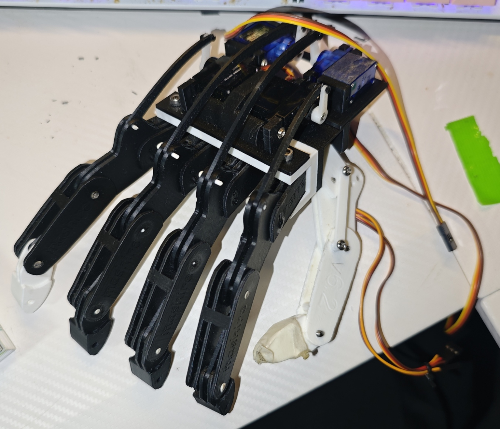

# Mech Hand V6

A 3D-printable robotic hand designed with a simple, modular, and easy-to-modify mechanism.

## 3D Model

[View Mech Hand V6 in GitHub's 3D viewer](STL/mech%20hand%20v6.stl)

[Download STEP file](STEP/mech%20hand%20v6_.step)

Each finger has three joints and is driven by a single SG90 micro servo.
The four main fingers can be controlled independently.

The modular design allows damaged parts to be replaced individually.
STEP files are also included, so you can modify dimensions, mechanisms, servo mounts, and other parts for your own project.

## Features

- Human-like three-joint finger movement
- One SG90 servo per finger
- Four independently actuated fingers
- Modular and repairable design
- STEP and STL files included
- Updated for modern 3D printers
- Some parts can also be manufactured from 2 mm aluminum plate using a CNC machine
- No complicated string-based mechanism

## Required Parts

- SG90 micro servo ×4
- M3 × 15 mm screw ×5
- 1.75 mm filament for joint pins / shafts

## Joint Hole Diameter

- 1.8 mm

## Recommended Tools

- 1.8 mm drill bit

A 1.8 mm drill bit is recommended for cleaning or adjusting the joint holes if necessary.

Depending on your printer calibration and filament, some parts may require minor sanding or adjustment.

## Thumb

The thumb is currently not designed for servo actuation.

Its mechanism has been simplified to improve reliability and ease of manufacturing.

## Files

- STL files for 3D printing
- STEP files for modification and CAD work

## Assembly

Assembly video:

[YouTube Video]
組み立て動画↓

https://youtu.be/qzkEr0LQfiU

https://youtu.be/XSJPnuex2js

動作／メカニズム動画↓

https://youtu.be/wdKK3u0CoiU

https://youtu.be/mYgcsvKeigU

https://youtube.com/shorts/7YCYWcchhKk

https://youtube.com/shorts/f-g6F6FUTs4

https://youtu.be/xJD88yebtpA

https://youtu.be/xWxtCqlGCMU

## Notes

Feel free to modify the STEP files for your own robotic hand, prosthetic research, mechanical experiments, or other projects.

If you improve the design or build your own version, I would be happy to see it.

## License

CC BY
